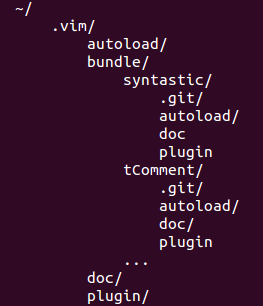

# Vim

.fx: first

/**/Mesut Çittir `<mesut.cittir@bil.omu.edu.tr>`

http://mctr.github.io

Sümeyra Özgür `<sumeyra.ozgur@bil.omu.edu.tr>`

http://sozgur.github.com

Mart 2014

---
## Vim

* Çok güçlü bir metin editörüdür

* C ve Vimscript ile yazılmıştır

* Bram Moolenaar tarafından geliştirilmiştir ve 1991 yılında yayınlanmıştır

* Vi, metin düzenleyici temel alınarak geliştirilmiştir. 

* Vi IMproved  => VİM

* Vim, GPL lisanslıdır

* Çoklu platform destegi saglamaktadır

* 2006 yılında Linux Journal okuyucuları tarafından en çok begenilen metin düzenleyicisi seçilmiştir

---
## Alternatifleri

* Emacs

* Kate

* Sublime Text

* Acme

* Geany

* Gedit

* TextMate

---

## Avantaj & Dezavantajı 

### Avantaj

* Dosya açma süresi

* Destekledigi karakter kodlamaları

* Çoklu pencere destegi

* Çoklu UNDO mekanizması

* Tampon bellek kullanımı

* İnsert/Komut modunda kelime/dosya tamamlama

### Dezavantajı

* Diger editörlere göre kullanımı biraz daha zordur

* Modlu kullanımı oldugu için bazılarına kullanımı zor gelebilir 
 
---

## Vim Nasıl Kurulur?

### Debian/Linux türevi işletim sistemleri için

* Uçbirim açılır ve aşağıdaki komut yazılır :
	
		$ sudo apt-get install vim	

---

## Vim Durumları

Vim 3 ana hattan oluşur

* İnsert
	+ `i` tuşuna basarak yazma moduna geçilir ve dosya üzerinde degişiklikler yapılabilir

* Escape
	+ `esc` tuşuna basarak escape moduna geçilir ve kısayollar kullanılabilir

* Command
	+ escape modunda iken `:` tuşuna basılarak komut moduna geçilir

	+ Dosya üzerinde işlemler yapılabilir, dış komut çalıştırılabilir, bul/degiştir yapılabilir	

---

## Dosya Açma

* Dosya adı vermeden vim açabiliriz ve kaydetme işlemini burada yapabiliriz
	+ $ vim
	+ :w main.txt
  
* Bulundugumuz dizinde `main.txt` adında dosya açalım
	+ $ vim main.txt

* Aynı anda birden fazla dosya açabilirsiniz
	+ $ vim filename1 filename2 filename3
	+ Açılışta ilk dosya açılır ve `:next` veya `:bn` komutu ile bir sonraki dosyaya, 
		`:prev` veya `:bp` komutu ile de bir önceki dosyaya geçiş yapabiliriz
  
* Diger seçenekler

	+ $ `vim +19 filename` dosyayı açar ve imleç 19. satıra gider
	+ $ `vim +filename` dosya açılır ve imleç son satıra gider
	+ $ `vim -d filename1 filename2` iki dosya arasındaki farkları gösterir

---

## Dosya Açma 2

* Yatay olarak ekranı ikiye bölerek yeni bir dosya açabiliriz
	+ `:split filename` veya `:sp filename`

* Dikey olarak ekranı ikiye bölerek yeni bir dosya açabiliriz 
	+ `:vsplit filename` veya `:vsp filename`   

* Açılan yeni pencereler arasında geçiş yapmak için önce `Ctrl + w` tuşuna daha sonra 
	geçiş yapmak istediginiz ekran tarafındaki yön tuşuna basmalısınız

* Dosyalar arası geçiş yapmak için `Ctrl + ww` tuşuna da basılabilir

---

## Kaydetme ve Çıkma

* Yapılan degişiklikleri dosyadan çıkmadan kaydetmek için `:w`

* Yapılan degişiklikleri kaydedip dosyadan çıkmak için `:wq`

* Dosyada herhangi bir degişiklik yapmadan, çıkmak için `:q`

* Yaptıgımız degişiklerin kaydedilmeden dosyayı ilk açtıgımız hali ile bırakmak için `:q!`

* Yaptıgımız degişikleri kaydedip dosyadan direk çıkmak için `ZZ` tuşlarına da basabiliriz

:	+ `:w newfile` komutu ile üzerinde çalıştıgımız dosyayı newfile adında yeni bir dosya olarak da kaydeder
	+ `saveas newfile` komutu ile yukardaki işlemin aynısı yapılır ve yeni dosyaya geçiş yapılır
	+ `5,19w newfile` komutu ile üzerinde çalıştıgımız dosyanın 5-19 satırları arasını newfile adlı yeni dosyaya kaydeder

---

## Seç-Kopyala-Yapıştır

### Seç

* `v` tuşuana basarak `visual` moduna geçilir ve seçme yapılabilir

* İmlecin bulundugu yerden satır sonuna kadar seçmek istiyorsak `$` işareti bizi satır sonuna götürür  

* Birden fazla satır seçmek istiyorsak imleci hareket ettirmemiz yeterli

### Kopyala

* Tüm satırı kopyalamak için `yy` tuşuna basalır

* Bir blog seçilmişse bunu kopyalamak için `y` tuşuna basmamız yeterli

### Yapıştır

* `p` tuşuna basılarak bir alt satıra yapıştırılabilir

* `P` tuşuna basılarak da bir üst satıra yapıştırılabilir

* İmlecin bulundugu tüm satırı kes-kopyala-yapıştır yapmak için `dd` tuşuna basılır ve yapıştırılmak istenen yere gelip `p` tuşuna basılır

---

## Dosya İçerisinde Dolaşma

* Dosya içerisinde h-j-k-l tuşları ve yön tuşları ile dolaşabiliyorduk

* `3j` komutu ile 3 satır aşagıya gidilir

* `fk` satırda saga dogru k harfinin bulundugu ilk yere gider

* `H` imleç ekranda gösterilen sayfa başına, `L` sayfa sonuna, `M` ise sayfa ortasına gider

* `gg` dosya başına, `G` dosya sonuna gider 

* `SHIFT + g`, imleç dosyanın sonuna gider 

* `:181` imleç 181.satıra gider 

* `19 SHIFT + G` ,imleç 19. satıra gider 

---
## Dosya İçerisinde Dolaşma 

* `Ctrl + g` tuşlayarak  aşagıda dosya hakkında(konumumuz, dosyanın durumu) bilgilere sahip olabiliriz 
	
* Satır sonuna gitmek için `$` tuşuna basılır

* Satır sonuna metin eklemek için `A` tuşuna basılır(Aynı zaman insert kipine geçer)

* `Ctrl + f` sayfa sayfa ileri gitmemizi saglar

* `Ctrl + b` sayfa sayfa geri gitmemizi saglar

* `Ctrl + e` dosyayı yukarı dogru kaydırır

* `Ctrl + y` dosyayı aşagı dogru kaydırır

---

## Arama 

* Bulmak istediginiz kelimeyi `escape` modunda iken `/kelime` yazın kelime bulunup imleç o kelimenin başına gidecektir

* Aynı kelime öbegini tekrar ileriye dogru aramak için `n` tuşuna, geriye dogru aramak için `SHIFT + N` tuşuna basarak ilerleyebilirsiniz

* Eger kelimeyi aramaya tersten başlamak istiyorsanız `?kelime` yazmanız yeterli

* Aranan kelimenin sonuna `\c` eklersek, aramayı küçük büyük harf duyarsız arama yapar

* İmlecin üzerinde bulundugu kelimeyi ileriye dogru aramak için `*` tuşuna basın

* İmlecin üzerinde bulundugu kelimeyi geriye dogru aramak için `#` tuşuna basın
 
---

## Bul - Degiştir

* İmlecin bulundugu satırdaki ilk  `eski` kelimesini `yeni` kelimesi ile degiştirelim
		`:s/eski/yeni`

* İmlecin bulundugu satırdaki tüm  `eski` kelimesini `yeni` kelimesi ile degiştirelim
		`:s/eski/yeni/g`

* İki satır arasındaki kelime öbeklerini degiştirmek için
		`:5,19s/eski/yeni/g`

* Bir dosyadaki tüm karşılaşmaları degiştirmek için
		`:%s/eski/yeni/g`

* Her seferinde onay sorması için
		`:%s/eski/yeni/gc`

---

## Dış Komut Nasıl Çalıştırılır

* Vim de bir dosyanın içerisindeyken dış komut çalıştırabiliyoruz

* Bunu `:!komut` bu komut sayesinde yapabiliyoruz 

* Bulundugumuz dizin altındaki dosya ve dizinleri listeleyelim `:!ls`

* Herhangi bir dosya silebiliriz `:!rm filename`

* `:r! cat filename` şeklinde kullanırsak komut çıktısını bulundugumuz dosyaya yazdırabiliriz

* Yukarıdaki işlemin aynısını `:r filename` komutu ile de yapabiliriz.İmlecin altına filename dosyasının içerigini yazar
 
---

## Yararlı Kısayollar

### Otomatik Tamamlama

* Vim, yazma modunda iken yazdıgımız bir kaç harften sonra dosya içerisinde bu harf veya harflerle başlayan kelimeleri listeler

* Bizde bu listeden seçip kelimenin tüm harflerini yazmamıza gerek kalmaz 

* Bunun için `ctrl + p` veya `ctrl + n` kombinasyonları kullanılabilir 
 
### Degişiklikleri Geri Alma

* Bir satırdaki tüm degişiklikleri geri almak için `U` 

* Dosya üzerinde yapılan degişiklikleri geri almak için escape modunda `u` harfine basarak,
	 veya komut modunda `:u` komutunu kullanarak yaptıgınız degişiklikleri geri alabilirsiniz

* Geri almaları geri almak için `Ctrl + r`

---

## Yararlı kısayollar

### Dosya Geçişi

* Vim de çalışırken bir dosyayı kapatıp yeni bir dosya açmak için ekstra işlemler yapmanıza gerek yok 
	`:e filename` dediginiz anda üzerinde çalıştıgınız dosya kapanır istediginiz dosya açılır

* `:e +19 filename` komutu ile imleç 19. satırda filename dosyası açılır

### Otomatik Girintileme

* `v` tuşuna basılarak visual moduna geçilir ve blok seçimi yapılır daha sonra 
	`=` tuşuna basarsak vim seçilen blogu otomatik olarak girintilemesini yapar

* `:<Tab>` iki noktadan sonra tab tuşuna bastıgımızda olası komutları görebiliriz

* `:help` yardım ekranını açar

---

## Kısayollar

* `dd` imlecin bulundugu satırı siler

* `dH` imlecin oldugu yerden ekranın başındaki satıra kadar siler

* `dL` ekranın sonuna kadar herşeyi siler

* `dG` imlecin bulundugu yerden dosyanın sonuna kadar herşeyi siler

* `yG` dosyanın sonuna kadar herşeyi kopyalar

* `yH` imlecin bulundugu yerden ekranın başındaki satıra kadar herşeyi kopyalar

* `yL` ekranın sonuna kadar herşeyi kopyalar

---

## Ortam Degişkenleri

Vim içerisinde standart ayarları kullanabileceginiz gibi bazen vim`in o ana özel davranmasını isteyebiliriz

Bunun için `:set` komutunu kullanarak vim`in istedigimiz gibi davranmasını saglayabiliriz

* `:syntax on` dosya tipine göre renklendirme/biçimlendirme yapar

* `:set number/nonumber` satır başlarında numara gözükmesini/gözükmemesini saglar

* `:set background=dark` arkaplanı koyulaştırır

* `:set is` arama şablonu yazılırken bulmaya başlar

* `:set ic` küçük büyük harf ayırt etmeden arar

* `:set hls` metin içinde arama şablonuna uyan bölümler belirginleştirilir

* `:set tabstop=4` tab uzunlugu ayarlanır

---

## Yapılandırma

* Yapılandırma ~/.vim dizininde ve ~/.vimrc dosyasında degişiklikler yapılarak olur

* Eklentiler ~/.vim dizininin altında yer alırlar

* Vim de istedigimiz ayarları bütün durumlarda kullanabilmek için bu ayarları ~/.vimrc dosyasına yazıp kaydetmemiz gerekir

* Vim her açılışında burdaki ayarları kullanarak açılacaktır

* Örnegim `syntax on` sözdizimine göre renklendirme yapar 

---

## Eklentiler

* Vim`in toplam 4786 tane eklentisi vardır

* Vim eklentilerini kurmanın farklı farklı yolları vardır

* Biz 2 farklı kurulumu anlatacagız

* `Pathogen` ve `Vundle` eklentileri ile eklenti kurmayı görecegiz

* Daha sonra `Syntastic` ve `tComment` eklentilerini kurup ne işe yaradıklarını , nasıl kullanıldıklarını kısaca görecegiz
 
---

## Vundle Kurulumu Ve Kullanımı

* Kurmak için şu komutu çalıştırıyoruz
	
	`$ git clone https://github.com/gmarik/vundle.git ~/.vim/bundle/vundle`

* Sonra .vimrc dosyasını açıp şunları yazıyoruz ve kaydediyoruz

:	set nocompatible
	
	filetype off
	
	set rtp+=~/.vim/bundle/vundle/
	
	call vundle#rc()
	
	Bundle 'gmarik/vundle'
	
	filetype plugin indent on

* vim i açıp şu komutu çalıştırıyoruz `:BundleInstall`

* Eklemek istedigimiz eklentiyi `Bundle 'scrooloose/syntastic'` şeklinde yazıyoruz ve komutu çalıştırıyoruz, bu komut bu eklentiyi kuruyor

---

## Pathogen Kurulumu

* Bu yöntemle kurulum yapmak için bilgisayaranızda curl kurulu olmalıdır

* Konsolu açıyoruz ve şu komutu çalıştırıyoruz 

: 	$ mkdir -p ~/.vim/autoload ~/.vim/bundle;
		curl -Sso ~/.vim/autoload/pathogen.vim https://raw.github.com/tpope/vim-pathogen/master/autoload/pathogen.vim

* Daha sonra .vimrc dosyasına şunları yazıyoruz ve kaydediyoruz

:	execute pathogen#infect()
	
	syntax on
	
	filetype plugin indent on

---

## Pathogen Kullanım

* Pathogen`i kurmuş olduk

* İndirmek istedigimiz eklentiyi `~/.vim/bundle` dizininin içerisine gelip `git clone` komutu ile indiriyoruz

* Pathogen ile kurulum da işte bu kadar

* Pathogen kullanıldıgında dizin yapısı aşagıdaki gibi olur

---

## Syntastic

* Bu eklentiyi anlattıgımız 2 yöntemden birisi ile kurup, kullanabilirsiniz

### Kullanımı

* Syntastic, dosyayı kaydettiğimizde sözdizimi denetlemesi yapar

* `:SyntasticCheck` manual olarak sözdizimi denetimi yapar

* `:SyntasticToggleMode` daha fazla bilgi görüntülemenin aktifligi ve pasifligi arasında degişim yapar

* `:SyntasticInfo` Syntastic mod, Dosya tipi ve mevcut checker hakkında bilgi verr

* `:Errors` Kodda hata bulduğu zaman hataları listeler

* `:SyntasticReset` Hata gösterimini resetleyip eski haline getiriyor.

---

## Syntastic

### Default Gelen Ayarlar

* `let g:syntastic_check_on_open = 1` Komut girmeden söz dizimi kontrolleri yapılmasını sağlar.Default degeri 0 olarak gelir

* Error ve Warning uyarılarının yanına sembolde yerleştirebilriz
	+ `let g:syntastic_error_symbol = '✗'`

	+ `let g:syntastic_warning_symbol = '⚠'`

*  Komut yazmadan otomatik olarak denetleme yapmasını istersek bu aşagıdakileri kullanabiliriz.Default degeri 2 olarak gelir

	+ `let g:syntastic_auto_loc_list = 0` Hata penceresi otomatik olarak açılmaz veya kapanmaz

	+ `let g:syntastic_auto_loc_list = 1` Hata tespit edildiğinde pencere otamatik olarak açılır tespit edilmediğinde otomatik olarak kapanır

	+ `let g:syntastic_auto_loc_list = 2` Hata tesipit edilmediğinde pencere otomatik olarak kapanır ama otomatik olarak açılmaz

* Daha detaylı bilgi için `:help syntastic`

---

## tComment

* Bu eklenti sayesinde programlama dillerinin yorum satırı yapma karakterlerini ezberlemenize gerek yok

* Eklenti hangi dosya üzerinde çalıştıgınızı algılar ve isteginize göre yorum satırı yapar

## Kullanım

* `gcc` imlecin üzerinde bulundugu satırı yorum satırı yapar

* `ctrl + _ ctrl + _ ` veya `:TComment` imlecin üzerinde bulundugu satırı yorum yapar  

* `gc` seçilen blogu komple yorum yapar

* `ctrl + _ b` veya `:TCommentBlock` seçilen blogu komple yorum yapar

* `ctrl + _ r` vaye `:TCommentRight` imlecin bulundugu yerden itibaren 	sag tarafı satır sonuna kadar yorum yapar 

---

## Sorular

.fx: first

## ?

---
